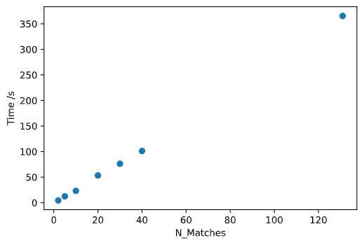

# StatsBomb event aggregation
## For creation of playing style models
Creator: Duncan Hunter

#### Installation
To make use of `feature_engineering.py`, the required packages can be installed with:

`$python -m pip install -r requirements.txt`

It's recommended as always to use a fresh environment. If you've done this, then to *use* the notebook in this folder, your environment will have to be installed as a kernel for jupyter:

`$python -m ipykernel install --user --name env-name --display-name "Python (env-name)"`

Then when opened in Jupyter, select the installed environment. Alternatively, if you're using VSCode, it's notebook feature allows you to select venvs without installing them with ipykernel.

#### Usage

At the moment the functionality of the project isn't 100% complete.

To create aggregated features from Statsbomb event data, use:

`$python feature_engineering.py`

Optional args:
```
--team_name: If you want to only aggregate features from one team's matches.
--competition_id: Select the statsbomb competition id you want to aggregate (default WSL).
--season_id: Select the statsbomb season_id you want to aggregate (default is WSL 19/20).
--out_dir: Directory to save results to (default is ./output)
--out_name: Name to save results to (default is aggregated_features.csv)
```

The features aggregated are as follows (with the current location model, more on that later):
**In the future this won't be hardcoded, and will be configurable**
 - pass_horizontal_ratios: Percentages of passses in each horizontal third.
 - pass_vertical_ratios: Percentages of passes in each vertical third.
 - shot_horizontal_ratios: Percentages of shots in each horizontal third (not very useful).
 - shot_vertical_ratios: Percetages of shots in each vertical third (also not very useful).
 - pressure_horizontal_ratios: Percentages of pressure events in each horizontal third.
 - pressure_vertical_ratios: Percentages of pressure events in each vertical third.
 - pass_count: Number of passes.
 - shot_count: Numer of shots.
 - dribble_count: Number of dribbles.
 - pass_normalised_count: Number of passes / total number of events.
 - shot_normalised_count: Number of shots / total number of events.
 - dribble_normalised_count: Number of dribbles / total number of events.
 - pass_direction_forward_ratio: Percentage of passes that are forward (defined as +45 < a > -45 degrees).
 - pass_direction_sideways_ratio: Percentage of passes that are sideways.
 - pass_direction_backward_ratio: Percentage of passes that are backwards (defined as a > 135, a <-135).
 - pass_short_ratio: Percentage of passes that are < 18 yds.
 - pass_medium_ratio: Percentage of passes that are 18 yds < length > 60 yds.
 - pass_long_ratio: Percentage of passes that are > 60 yds.
 - shot_aerial_won_ratio: Percentage of shots that are aerial won.
 - shot_first_time_ratio: Percentage of shots that are first time.
 - pass_success_ratio: Percentage of passes that are succesful.
 - pass_cross_ratio: Percentage of passes that are crosses.
*more interesting features like time on ball would be added in future development.*

Features are aggregated over matches and teams. In the future the plan is to aggregate over possession sequences as well, or rolling time windows to have more fine grained details. To implement other types of aggregation, it can be easy as it's a matter of choosing which columns to use in a groupby.

#### Location models:
The ratios above (vertical thirds, horizontal thirds) are calculated by finding the closest midpoint of a user defined zone to a location of an event. In `constants.py` the location models for thirds are defined:

```python
HORIZONTAL_MIDPOINTS = {
    "left_wing": [60, 0],
    "centre": [60, 40],
    "right_wing": [60, 80]
}

VERTICAL_MIDPOINTS = {
    "back": [0, 40],
    "middle": [60, 40],
    "forward": [80, 40]
}
```

By using this method, a pitch can be divided into zones in a fairly generalized way. At the moment there isn't a nice way of specifying these models, but if I get configuration working (I had a nightmare in YAML), it would be possible.

#### Use in modelling:
In the modelling.ipynb notebook I had a look at how the features varied. I also then showed what my basic idea would be to create a clustering model, using a number of features of interest, then reduce dimensionality using TSNE and train a density based clustering model. I didn't spend much time on that part.

#### Development/Testing:
For harder functions I used test driven development, by calling pytest. I really haven't had enough time to be as rigorous as I wanted.

#### Runtime
It looks like it runs in linear time which is nice:

